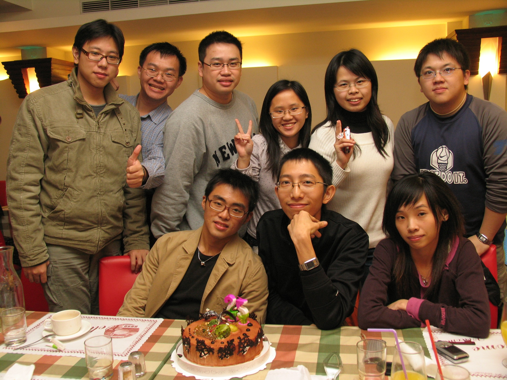
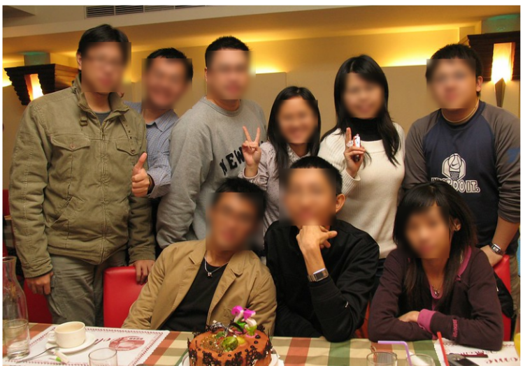

# OSS_TERM (FINAL CODE1,2 참고)
Our project is **to blur the face after recognizing the face** in the image.  
And we used open source with facial recognition.

## There are three characteristics in detail

1. Convert photos to black and white (FInal code1)
2. face recog and circle the face (FInal code1)
3. Recognizing the number of people in the picture (FInal code2)
4. Blur the face into a rectangular after recognizing it (FInal code2)

---

### Requirement

Jupyter Notebook 
opencv-python(3.4.5.20)

---

#### Face Recognition & Blur

- download : haarcascade_frontalface_default.xml
[Download](https://github.com/opencv/opencv/tree/master/data/haarcascades)

- install : matplotlib

## Our Result 
  
===============face recog and blur================  

- [source code](https://github.com/serengil/tensorflow-101/blob/master/python/Blurring.ipynb)

